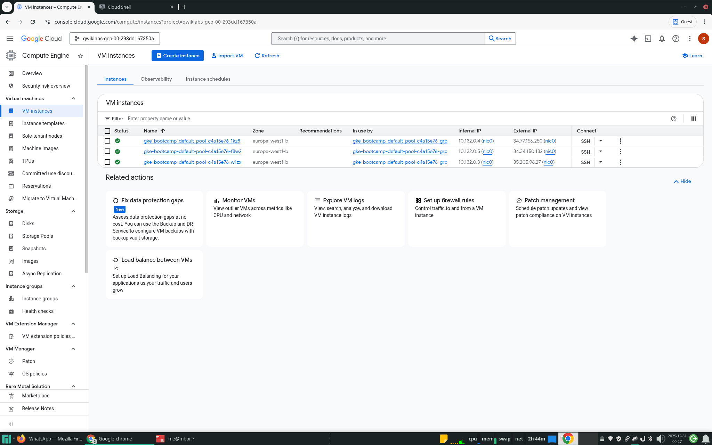
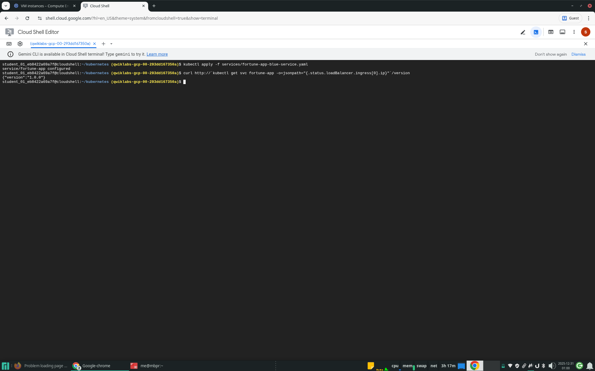

# Managing Deployments Using Kubernetes Engine

This repository contains my hands-on work for the [Google Cloud Skills Boost](https://www.cloudskillsboost.google/) lab: **Managing Deployments Using Kubernetes Engine**.

## Project Overview

This project demonstrates practical experience with Kubernetes deployment management on Google Kubernetes Engine (GKE). The lab exercises cover essential DevOps practices including continuous deployment strategies, scaling applications, and implementing various deployment patterns used in production environments.

DevOps practices regularly utilize multiple deployment strategies to manage application updates effectively. This project showcases three common deployment scenarios:
- **Rolling Updates**: Gradually replacing instances of the previous version with the new version
- **Canary Deployments**: Testing new versions with a subset of users before full rollout
- **Blue-Green Deployments**: Running two identical production environments to enable instant switchover

## Objectives

The following skills were practiced and demonstrated in this lab:

- Use the `kubectl` command-line tool to manage Kubernetes clusters
- Create and configure deployment YAML files
- Launch, update, and scale deployments
- Perform rolling updates with pause/resume capabilities
- Execute rollback operations
- Implement canary deployment strategies
- Implement blue-green deployment strategies

## Technologies Used

| Technology | Description |
|------------|-------------|
| **Google Kubernetes Engine (GKE)** | Managed Kubernetes service on Google Cloud Platform |
| **Kubernetes** | Container orchestration platform |
| **kubectl** | Kubernetes command-line interface |
| **Docker** | Container runtime |
| **YAML** | Configuration file format for Kubernetes manifests |
| **Google Cloud Shell** | Browser-based command-line environment |

## Architecture Overview

The lab environment consists of:

1. **GKE Cluster**: A 3-node Kubernetes cluster running on `e2-small` machine types
2. **Deployment Objects**: Kubernetes Deployments managing pod replicas
3. **Service Objects**: LoadBalancer services exposing applications externally
4. **Container Images**: Fortune-service application with versions 1.0.0 and 2.0.0

### Deployment Strategy Architecture

```
┌─────────────────────────────────────────────────────────────┐
│                     LoadBalancer Service                     │
│                      (fortune-app)                           │
└──────────────────────────┬──────────────────────────────────┘
                          │
         ┌────────────────┼────────────────┐
         │                │                │
         ▼                ▼                ▼
┌─────────────┐   ┌─────────────┐   ┌─────────────┐
│   Blue      │   │   Canary    │   │   Green     │
│ Deployment  │   │ Deployment  │   │ Deployment  │
│  (v1.0.0)   │   │  (v2.0.0)   │   │  (v2.0.0)   │
│  3 replicas │   │  1 replica  │   │  3 replicas │
└─────────────┘   └─────────────┘   └─────────────┘
```

## Repository Structure

```
gcp-kube/
├── deployments/
│   ├── fortune-app-blue.yaml      # Blue deployment (v1.0.0)
│   ├── fortune-app-canary.yaml    # Canary deployment (v2.0.0)
│   └── fortune-app-green.yaml     # Green deployment (v2.0.0)
├── services/
│   ├── fortune-app.yaml           # Generic service selector
│   ├── fortune-app-blue-service.yaml   # Blue version selector
│   └── fortune-app-green-service.yaml  # Green version selector
├── images/                        # Lab screenshots
├── tls/                          # TLS certificates
└── README.md
```

---

## Step-by-Step Implementation

### 1. Cluster Creation

The first step involves creating a Google Kubernetes Engine cluster with 3 nodes. This provides the compute infrastructure for running containerized applications.

**Command executed:**
```bash
gcloud container clusters create bootcamp \
  --machine-type e2-small \
  --num-nodes 3 \
  --scopes "https://www.googleapis.com/auth/projecthosting,storage-rw"
```


The cluster creation process takes a few minutes. Once complete, the cluster is ready to accept workloads.



---

### 2. Deployment Creation

With the cluster running, the next step is deploying the application. Kubernetes Deployments provide declarative updates for Pods and ReplicaSets.

**Deployment configuration (`deployments/fortune-app-blue.yaml`):**
```yaml
apiVersion: apps/v1
kind: Deployment
metadata:
  name: fortune-app-blue
spec:
  replicas: 3
  selector:
    matchLabels:
      app: fortune-app
  template:
    metadata:
      labels:
        app: fortune-app
        track: stable
        version: "1.0.0"
    spec:
      containers:
        - name: fortune-app
          image: "us-central1-docker.pkg.dev/qwiklabs-resources/spl-lab-apps/fortune-service:1.0.0"
          ports:
            - name: http
              containerPort: 8080
```

**Commands executed:**
```bash
kubectl create -f deployments/fortune-app-blue.yaml
kubectl get deployments
kubectl get replicasets
kubectl get pods
```

Kubernetes creates a ReplicaSet to manage the pods, ensuring 3 replicas are always running.


---

### 3. Service Exposure

To make the application accessible externally, a LoadBalancer Service is created. This provisions a Google Cloud Load Balancer and assigns an external IP address.

**Commands executed:**
```bash
kubectl create -f services/fortune-app.yaml
kubectl get services fortune-app
```

**Verifying the application endpoint:**
```bash
curl http://<EXTERNAL-IP>/version
```


The application responds with `{"version":"1.0.0"}`, confirming the deployment is operational.

---

### 4. Scaling the Application

Kubernetes makes it easy to scale applications horizontally by adjusting the number of replicas.

**Commands executed:**
```bash
# Scale up to 5 replicas
kubectl scale deployment fortune-app-blue --replicas=5

# Verify pod count
kubectl get pods | grep fortune-app-blue | wc -l

# Scale back to 3 replicas
kubectl scale deployment fortune-app-blue --replicas=3
```


---

### 5. Rolling Update

Rolling updates allow you to update an application to a new version with zero downtime. Kubernetes gradually replaces pods running the old version with pods running the new version.

**Triggering the update using `kubectl edit`:**
```bash
kubectl edit deployment fortune-app-blue
```

Changes made:
- Updated image tag from `1.0.0` to `2.0.0`
- Updated `APP_VERSION` environment variable from `1.0.0` to `2.0.0`


**Observing the rollout:**
```bash
kubectl get replicaset
kubectl rollout history deployment/fortune-app-blue
```
---

#### Pause and Resume Rollout

Kubernetes allows pausing a rollout mid-way to perform additional testing or gradual traffic shifting.

```bash
# Pause the rollout
kubectl rollout pause deployment/fortune-app-blue

# Check rollout status
kubectl rollout status deployment/fortune-app-blue

# Resume the rollout
kubectl rollout resume deployment/fortune-app-blue
```

#### Rollback

If issues are detected, Kubernetes can instantly roll back to the previous version.

```bash
kubectl rollout undo deployment/fortune-app-blue
curl http://<EXTERNAL-IP>/version
```

---

### 6. Canary Deployment

Canary deployments allow testing a new version with a small subset of users before full rollout. This pattern reduces the blast radius of potential issues.

**Canary deployment configuration (`deployments/fortune-app-canary.yaml`):**
```yaml
apiVersion: apps/v1
kind: Deployment
metadata:
  name: fortune-app-canary
spec:
  replicas: 1
  selector:
    matchLabels:
      app: fortune-app
  template:
    metadata:
      labels:
        app: fortune-app
        track: canary
        version: "2.0.0"
```

**Commands executed:**
```bash
kubectl create -f deployments/fortune-app-canary.yaml
kubectl get deployments
```


**Verifying canary traffic distribution:**
```bash
for i in {1..10}; do 
  curl -s http://<EXTERNAL-IP>/version
  echo
done
```

With 3 blue pods (v1.0.0) and 1 canary pod (v2.0.0), approximately 25% of traffic goes to the new version.

---

### 7. Blue-Green Deployment

Blue-green deployments maintain two identical production environments. Traffic switching is instantaneous by updating the Service selector.

**Step 1: Point service to blue deployment only**
```bash
kubectl apply -f services/fortune-app-blue-service.yaml
```

**Step 2: Create the green deployment**
```bash
kubectl create -f deployments/fortune-app-green.yaml
```


**Step 3: Switch traffic to green**
```bash
kubectl apply -f services/fortune-app-green-service.yaml
curl http://<EXTERNAL-IP>/version
```

**Rollback (if needed):**
```bash
kubectl apply -f services/fortune-app-blue-service.yaml
```


---

### Lab Completed

All lab objectives were successfully completed, including cluster creation, deployment management, scaling, rolling updates, canary deployments, and blue-green deployments.


---

## Conclusion / What Was Learned

This lab provided hands-on experience with several critical Kubernetes deployment strategies:

| Deployment Strategy | Use Case | Trade-offs |
|---------------------|----------|------------|
| **Rolling Update** | Standard updates with zero downtime | Gradual rollout; both versions run simultaneously |
| **Canary Deployment** | Testing new versions with limited traffic | Requires traffic splitting; monitoring essential |
| **Blue-Green Deployment** | Instant cutover with instant rollback | Requires double resources; clean separation |

### Key Takeaways

1. **Kubernetes Deployments** provide declarative pod management with built-in scaling and update capabilities
2. **Rolling updates** enable zero-downtime deployments with automatic rollout and rollback
3. **Canary deployments** reduce risk by validating changes with real production traffic
4. **Blue-green deployments** provide instant switching and rollback capabilities
5. **Label selectors** in Services determine traffic routing between deployment versions

### Skills Demonstrated

- ✅ GKE cluster provisioning and management
- ✅ Kubernetes deployment and service configuration
- ✅ Horizontal pod scaling
- ✅ Rolling update execution and rollback
- ✅ Canary deployment strategy implementation
- ✅ Blue-green deployment pattern implementation
- ✅ kubectl command-line proficiency
